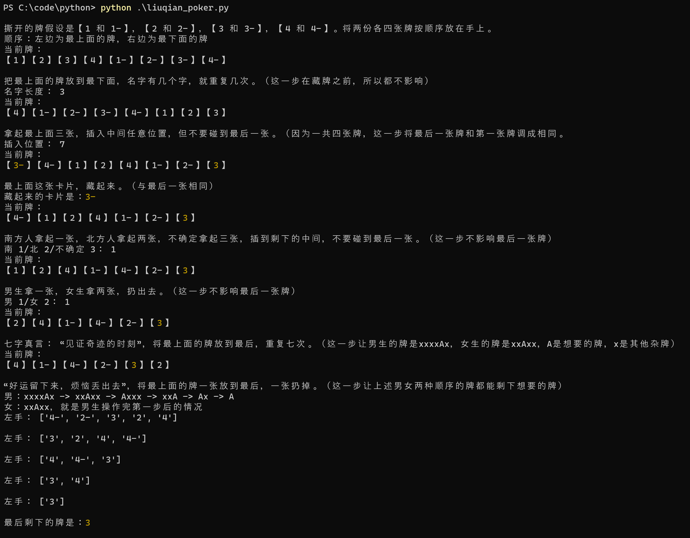

# 2024 龙年春晚 刘谦第二个扑克魔术解释

刘谦这次表演的第二个魔术和数学、编程非常相关，所以我想为大家解释一下这个魔术的原理。

执行这个Python程序来观看一次随机的演示：
```
python liuqian_poker.py
```



我们可以把这个程序当做这个魔术的数学建模，因为我们用数字和数学符号来替代了真实的牌和动作。

经过数学建模，我们可以看到，一些让人眼花缭乱的操作可以被描述的十分清晰和简单，而数学的等式是放之四海而皆准的，所以刘谦敢说全世界的结果都是这样（除非像他边上那位哥那样没有严格按照刘谦步骤操作的：）。

根据这种思想，我们也可以自己开发一些小魔术，例如：

请在脑子里选择从1到100的任意一个数，例如你选了 88，

然后将这个数 +1，例如你得到 89，

然后将这个数 -1。啊哈！你是不是得到了跟你原先选的一模一样的数！！

哈哈，可能你觉得这个魔术太简单，但只要你增加足够多的数学步骤之后，你的魔术就不再那么明显了！希望你能开发出属于你自己的有趣的魔术！
